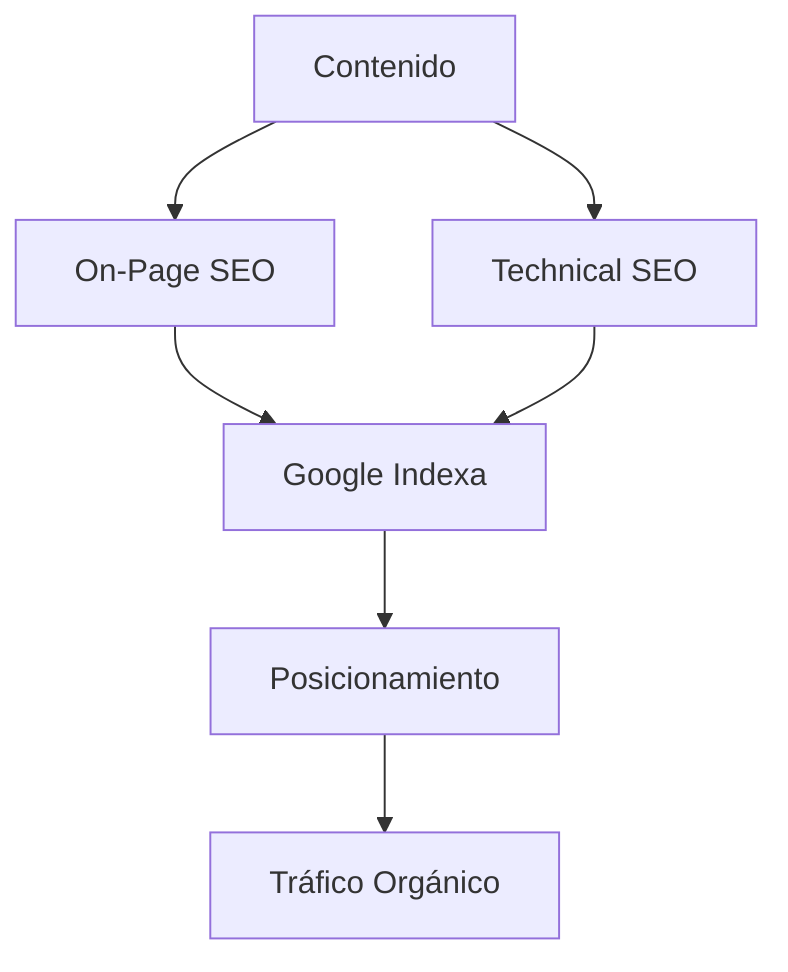
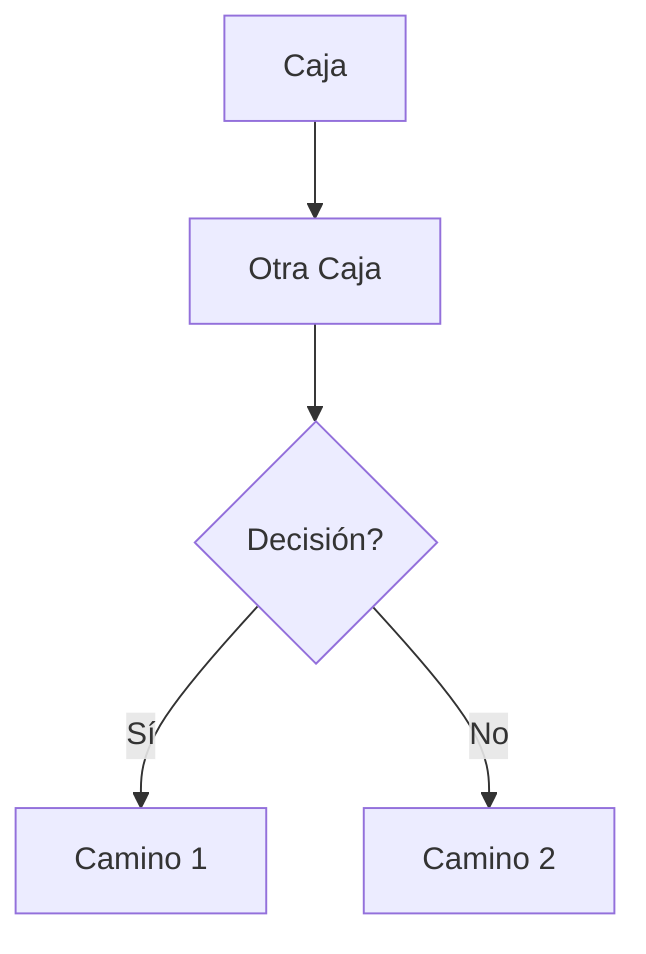

# Template 3: Con Diagrama Mermaid
 
Úsalo para conceptos complejos que necesitan visualización.
 
---
 
## 1. Título + Visión General
 
````markdown
# Flujo de SEO
## Visión General
 

````
 
Resultado
 
# Flujo de SEO
## Visión General
 
````mermaid
graph TD
    A[Contenido] --> B[On-Page SEO]
    B --> C[Google Indexa]
    C --> D[Posicionamiento]
    A --> E[Technical SEO]
    E --> C
    D --> F[Tráfico Orgánico]
````
 
---
 
## 2. Explicación de Componentes
 
````markdown
## Explicación de Componentes
 
### Contenido
Crear artículos de calidad y relevantes para el tema.
 
### On-Page SEO
Optimizar H1, meta descriptions, URLs, palabras clave.
 
### Technical SEO
Velocidad de carga, mobile-friendly, sitemap.xml.
````
 
Resultado
 
## Explicación de Componentes
 
### Contenido
Crear artículos de calidad y relevantes para el tema.
 
### On-Page SEO
Optimizar H1, meta descriptions, URLs, palabras clave.
 
### Technical SEO
Velocidad de carga, mobile-friendly, sitemap.xml.
 
---
 
## 3. Flujo Detallado
 
````markdown
## Flujo Detallado
 
1. Creas contenido relevante
2. Aplicas On-Page y Technical SEO
3. Google indexa tu contenido
4. Subes en posicionamiento
5. Recibes tráfico orgánico
````
 
Resultado
 
## Flujo Detallado
 
1. Creas contenido relevante
2. Aplicas On-Page y Technical SEO
3. Google indexa tu contenido
4. Subes en posicionamiento
5. Recibes tráfico orgánico
---
 
## 4. Casos de Uso
 
````markdown
## Casos de Uso
 
- Flujos de proceso técnico
- Arquitectura de sistemas
- Ciclos y decisiones
````
 
Resultado
 
## Casos de Uso
 
- Flujos de proceso técnico
- Arquitectura de sistemas
- Ciclos y decisiones
---
 
## Sintaxis básica Mermaid
 
````markdown

````
 
Resultado
 
````mermaid
graph TD
    A[Caja] --> B[Otra Caja]
    B --> C{Decisión?}
    C -->|Sí| D[Camino 1]
    C -->|No| E[Camino 2]
````
 
---