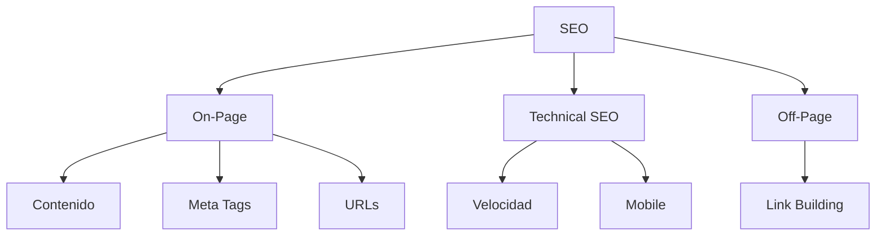

# Ejemplo Diagrama - SEO

## Pilares del SEO

```mermaid
graph TD
    A[SEO] --> B[On-Page]
    A --> C[Technical SEO]
    A --> D[Off-Page]
    B --> E[Contenido]
    B --> F[Meta Tags]
    B --> G[URLs]
    C --> H[Velocidad]
    C --> I[Mobile]
    D --> J[Link Building]
```

## Explicación

Los 3 pilares del SEO son interdependientes...